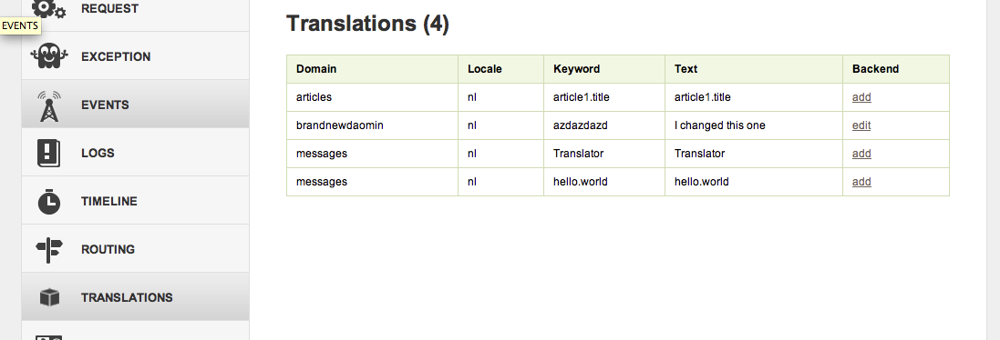

# KunstmaanTranslatorBundle [](http://travis-ci.org/Kunstmaan/KunstmaanTranslatorBundle)

A bundle which enables editing translations in the admin interface without need for editing the translations files.
Translations will be stored in a (default) database and retrieved on the most efficient way possible.

It's possible to create your own stasher to store your translation files.

Installation requirements
-------------------------
You should be able to get Symfony >=2.3 up and running before you can install the KunstmaanTranslatorBundle.

Installation instructions
-------------------------
Assuming you have installed composer.phar or composer binary:

``` bash
$ composer require kunstmaan/translator-bundle
```

Add the KunstmaanTranslatorBundle to your AppKernel.php file:

```PHP
new Kunstmaan\Translator\KunstmaanTranslatorBundle(),
new Doctrine\Bundle\MigrationsBundle\DoctrineMigrationsBundle(),
```

Add the KunstmaanTranslatorBundle to your routing.yml. Take your own routing into account, it's possible you will need to add the following code prior to your own routing configurations

```PHP
KunstmaanTranslatorBundle:
    resource: "@KunstmaanTranslatorBundle/Resources/config/routing.yml"
    prefix:   /
```

Overwrite the KunstmaanTranslatorBundle config to your needs in config.yml :

```PHP
kuma_translator:
    enabled: true
```

Migrate dev translations to production
------------------------------------------

Note: only use this with a SQL stasher.

Use the following command to generate a doctrine migration with all new and updated translations from your current environment.
```
app/console kuma:translator:migrations:diff
```

When you want to include these migrated translations into your (other) environment use the normal doctrine migrate command.

```
app/console doctrine:migrations:migrate
```

Import existing translation files
-------------------------------------
When migrating your current project you can easily import the existing translation files.

Without parameters, all translations, locales from the current `main` project will be included.
If you have already existing translations in the stasher with the same combination of 'domain', 'keyword', 'locale', non of them will be overwritten

```
app/console kuma:translator:import
```

To force overwrite the existing translations in the stasher:

```
app/console kuma:translator:import --force
```

To import translations from a specific bundle:
```
app/console kuma:translator:import --bundle=superCoolNewApplicationBundle
```

To import only specific locales:
```
app/console kuma:translator:import --locales=nl,fr,de
```

To import translations from the global Resources (app/Resources/translations)
```
app/console kuma:translator:import --globals
```

How does the cache work
-------------------------------------

Translations are stored in a database, but cached when not running in debug mode.

```php
$kernel = new AppKernel('prod', false); // translations are cached an read from this cache
```

```php
$kernel = new AppKernel('dev', true); // translations are always loaded from the stash (slower, more queries)
```

When editing translations in the backend changes aren't immediately visible on your website.
The backend will show a warning message when not newer or updated translations aren't loaded into the cache.
Click on the `flush cache`button to rebuild the cache.

Clear cache and request status
-------------------------------------

Clear translation cache files, this will trigger a rebuild of the translation cache when visiting a page
```
app/console kuma:translator:cache --flush
```

Request status of the current cache
```
app/console kuma:translator:cache --status
```

Reset translation flags
-------------------------------------
When all translations are up to date, e.g when migrated all develop translations into production. You need to reset all the flags which mark translations as new or updated.

```
app/console kuma:translator:flag --reset
```

Lookup keyword/domain of your translations
-------------------------------------------
You probably don't always remember which keyword and/or domain your translations on specific pages are using. To solve this problem you can add an extra GET parameter to your request. Add `?transSource=1` to your url to see all sources of the translated labels.

You instead of "Hello world" you might see `header.hello_world (messages)`. This means:

* keyword is header.hello_world
* domain is messages

Symfony Profiler integration
-----------------------------

The Symfony2 Profiler show the number of translations used on the current request:


When you click on this item, you can see all translations used on the current request and a link to add or edit them in the Kunstmaan Admin backend.




Features
-------------------------------------
* Import bundle/global translations from any type of translation file
* Import only specific translations (onlu from console command)
* Force import to overwrite existing translations with same domain/keyword/locale
* Edit stored translations from the backend interface
* Add new translations from the backend interface
* Translations are cached (if debug is disabled)
* Warning when cached translations aren't up to date with the stored translations
* Clear translation cache to rebuild translations from the stored translations
* Newer or updated translations are flagged
* Create a Doctrine Migrations file with all flagged translations
* Reset all flagged translations (from console command)
* Clear and check translation cache from console command
* Check your page with the keyword and domain of all translations


Development instructions
-------------------------

Run unit tests

```bash
./vendor/bin/phpunit -c phpunit.xml.dist
```

Run PHP CS Fixer, after [installing php-cs-fixer system wide](https://github.com/fabpot/PHP-CS-Fixer#globally-manual)

```bash
php-cs-fixer fix .
```

How to create your own file exporter
-------------------------
* Tag your exporter with `translation.exporter
* implement \Kunstmaan\TranslatorBundle\Service\Exporter\FileExporterInterface
